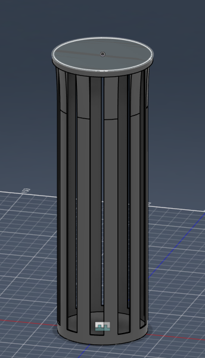
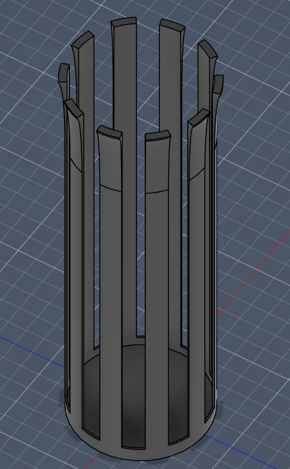
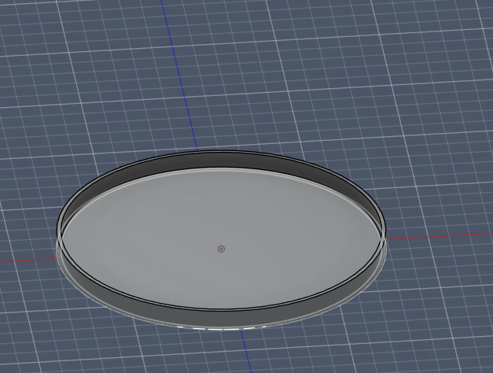

# container
a 3d model I made

Some challenges I made was trying to optimize for my 3d printer, I ended up making it worse somehow due to the gaps making the top complicated. I ended up simplifying my build and it ended up pretty well. I also am having trouble with GitHub, I have no idea how this works and this is also one of my biggest challenges to overcome.

